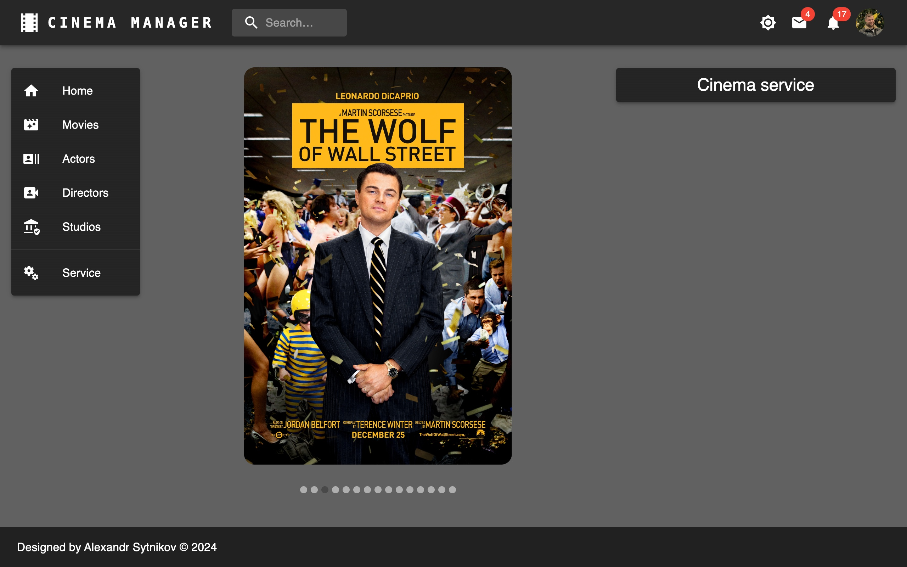
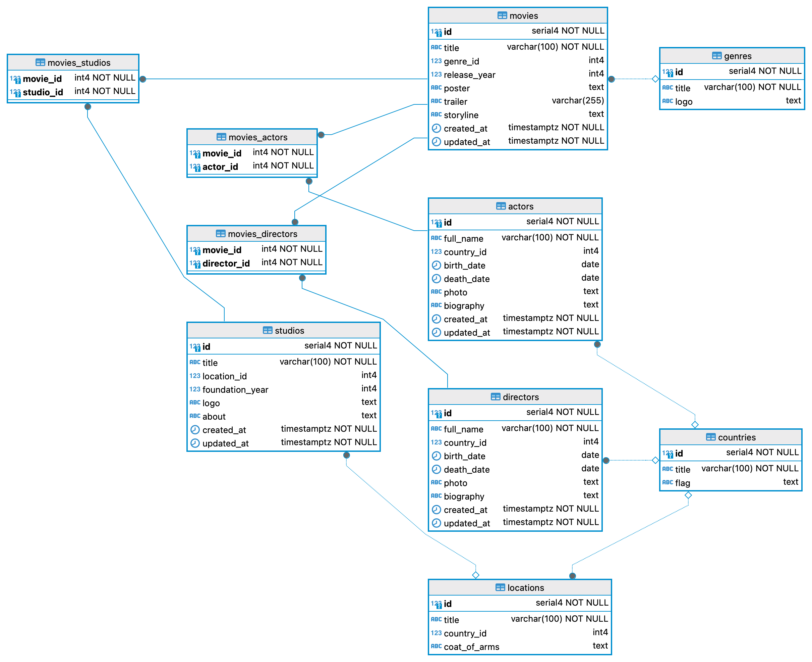

# CLIENT & SERVER with Lerna

<p align="center">
  
</p>

<p align="center">
  
</p>

## Project Description

Cinema manager client is a project that implements the ability to store and organize information about movies, actors, directors, and studios. It allows users to store and view information about actors and directors, as well as view movie storylines and trailers.

# ↓ Screenshots of the Project ↓

<details>
  <summary><strong>Here are some screenshots of the project, click to expand:</strong></summary>
  





</details>

## Entity Relationship Diagram

<p align="center">
  
</p>

## Key Highlights

- **Main Entities**:

  - **Actors**: Information about actors
  - **Directors**: Information about directors
  - **Movies**: Information about movies
  - **Studios**: Information about studios

- **Secondary Entities**:

  - **Genres**: Movie genres
  - **Countries**: Countries
  - **Locations**: Locations

## Features

### Client:

- **CRUD Operations**: Full Create, Read, Update, and Delete functionality for main and second entities.
- **Form Handling**: Dynamic forms with validation using Yup and Formik.
- **Pagination**: Efficient data management with paginated lists.
- **Responsive Design**: Optimized for both desktop and mobile devices.
- **Dark Theme**: Stylish dark theme for a modern look and feel.
- **Carousel Component**: Showcase movie posters with a carousel component.
- **Error Handling**: User-friendly error messages and notifications.
- **Localization**: Support for multiple locations and nationalities.

### Server:

- **CRUD Operations**: Full Create, Read, Update, and Delete functionality for movies, actors, directors, studios, genres, countries, and locations.
- **Pagination**: Implemented pagination with customizable limits and sorting for efficient data retrieval in controllers for genres, countries, locations, and actors.
- **Validation**: Comprehensive validation using Yup for input data to ensure data integrity and proper error handling.
- **Error Handling**: Centralized error handling with clear and informative error messages using the 'http-errors' library.
- **Logging**: Added logging functionality for debugging and tracking operations in the create movie function and other critical areas.
- **Database Operations**: Advanced database interactions with Sequelize, including handling 'null' values, relationships, and seeding data.
- **Date and Time Formatting**: Utilizes Moment.js to format date and time fields for human-readable output.
- **Middleware**: Custom middleware for handling validation, error processing, and setting default limits for pagination.
- **Data Consistency**: Ensures consistency in data formats and handles different data types, such as strings and objects, across various controllers.

## Database Interaction

Sequelize is used for database interaction, with models, migrations, and seeders defined for initial data population. Controllers are written to handle client interactions with the database through this server.

## Technologies and Libraries

- **Lerna**: Library is a fast, modern build system for managing and publishing multiple JavaScript/TypeScript packages from the same repository **(must be installed as global dependencies)**.

### Client:

- **React**: Library for building user interfaces.
- **Material UI**: UI components and styling.
- **Formik**: Form management and validation.
- **Yup**: Schema validation for form fields.
- **Axios**: HTTP requests.
- **React Router**: Routing and navigation.
- **Vite**: Build tool for fast development.
- **React player**: For displaying movie trailers.
- **@reduxjs/toolkit 2**: For application state management (currently disabled).

### Server:

- **Cors**: To handle cross-domain requests.
- **Http-errors**: To handle and display errors.
- **Sequelize & Sequelize-cli**: For interacting with the database, along with the **pg** and **pg-hstore** drivers.
- **Yup**: For validation.
- **Moment**: For date handling.
- **Dotenv**: For environment variable management.

## System Requirements

- **Git**: 2.46
- **NodeJS**: v18.20
- **NPM**: 10.8
- **PostgreSQL**: 16.3

## Installation

Before starting the installation, you should check whether you have lerna installed as a global dependency:

```bash
  npm i -g lerna
```

1. Clone the repository:
   ```bash
   git clone git@github.com:sytnikovzp/Cinema-manager.git
   ```
2. Navigate to the project directory:
   ```bash
   cd Cinema-manager
   ```
3. Install dependencies:

   ```bash
   npm i
   ```

## Config variables at '/packages/server/.env'

Create your configuration file `.env`

```yaml
PORT=5000
DB_PORT=5432
DB_USER=postgres
DB_PASS=root
DB_NAME=cinema_manager
DB_HOST=localhost
```

## Database Initialization

1. Creating new Database:

   ```bash
    lerna exec --scope server -- npm run dbcreate
   ```

2. Run Migrations & Seeding the Database:

   ```bash
    lerna exec --scope server -- npm run initial
   ```

## Start Client & Server

### With express & sequelize:

```bash
lerna run dev
```

### or with express & json-server:

```bash
lerna run fake
```

## To terminate client & server press:

```bash
CTRL + C
```

## Links

- [CINEMA MANAGER client (with Vite)](https://github.com/sytnikovzp/Cinema-manager-client)

- [CINEMA MANAGER server (with Express & Sequelize)](https://github.com/sytnikovzp/Cinema-manager-server)

- [CINEMA MANAGER server (with Express & Json-Server)](https://github.com/sytnikovzp/Cinema-manager-json-server)
