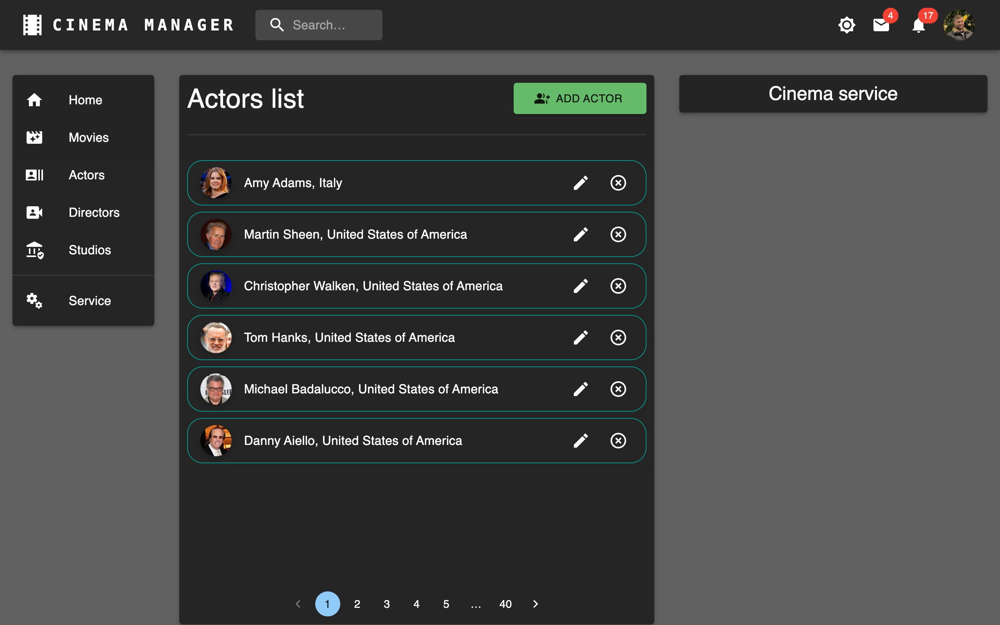
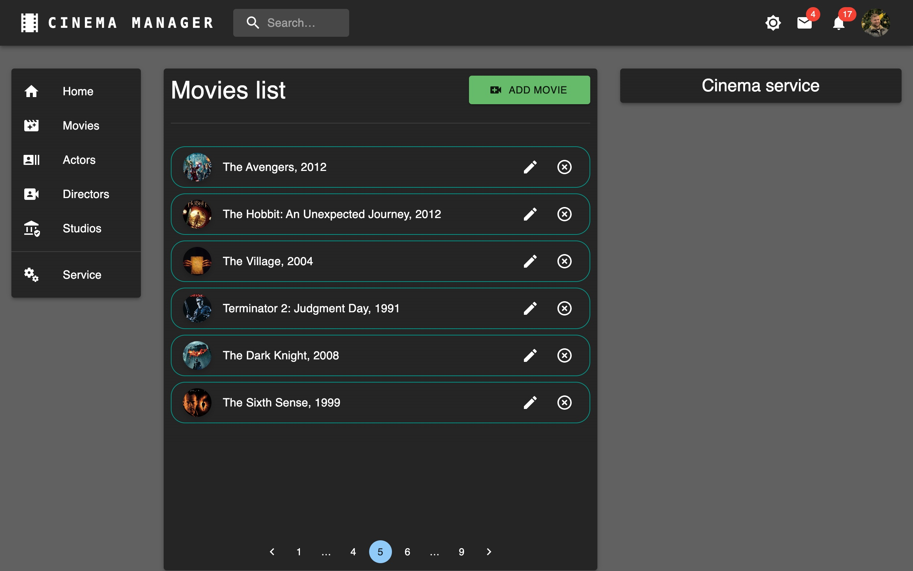
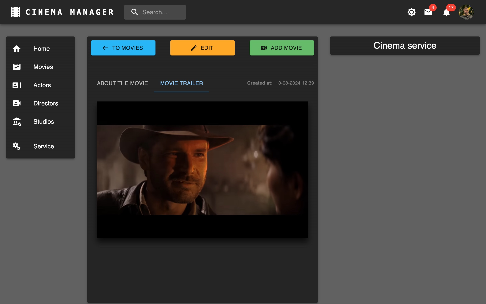
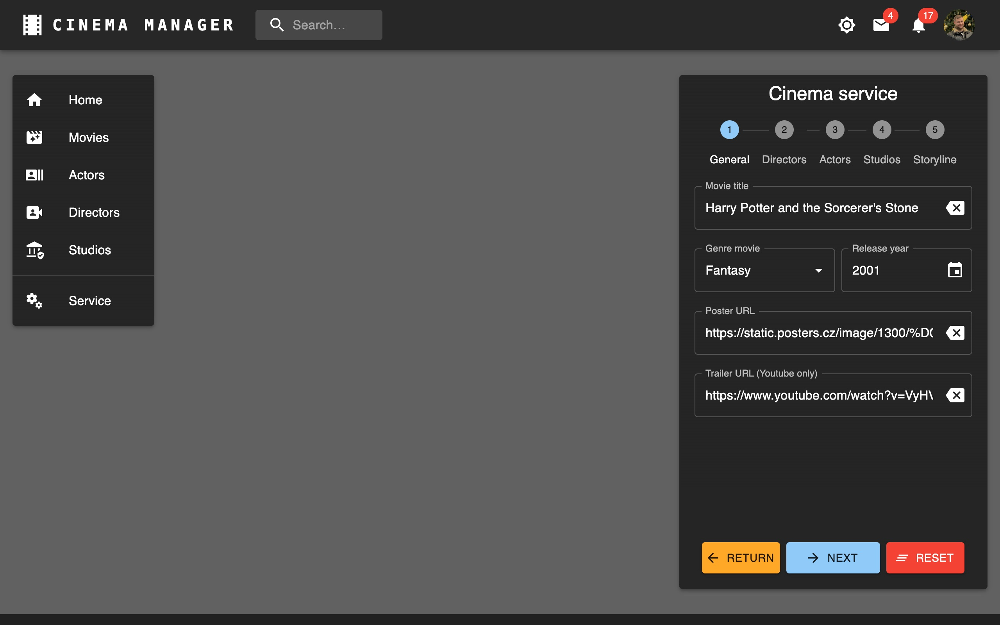
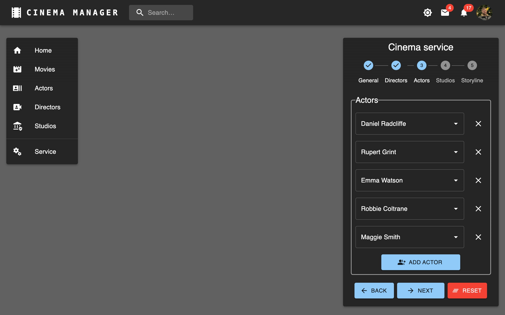
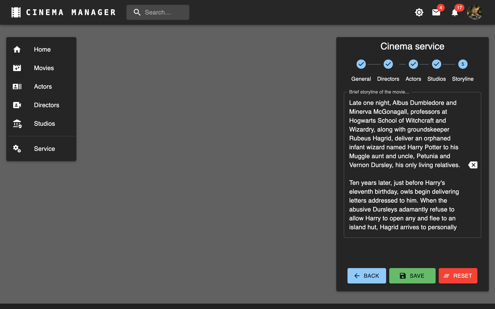
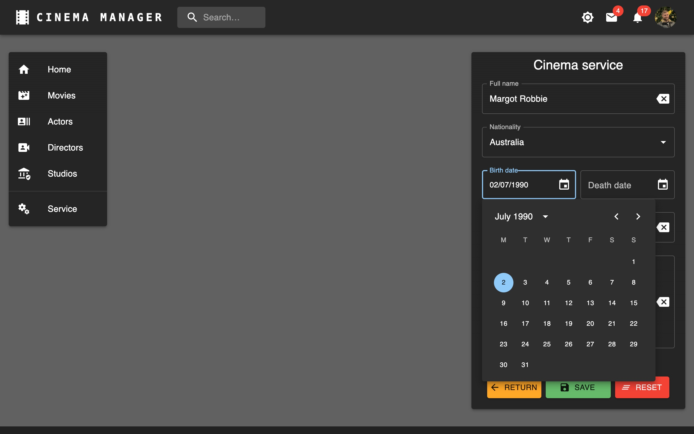
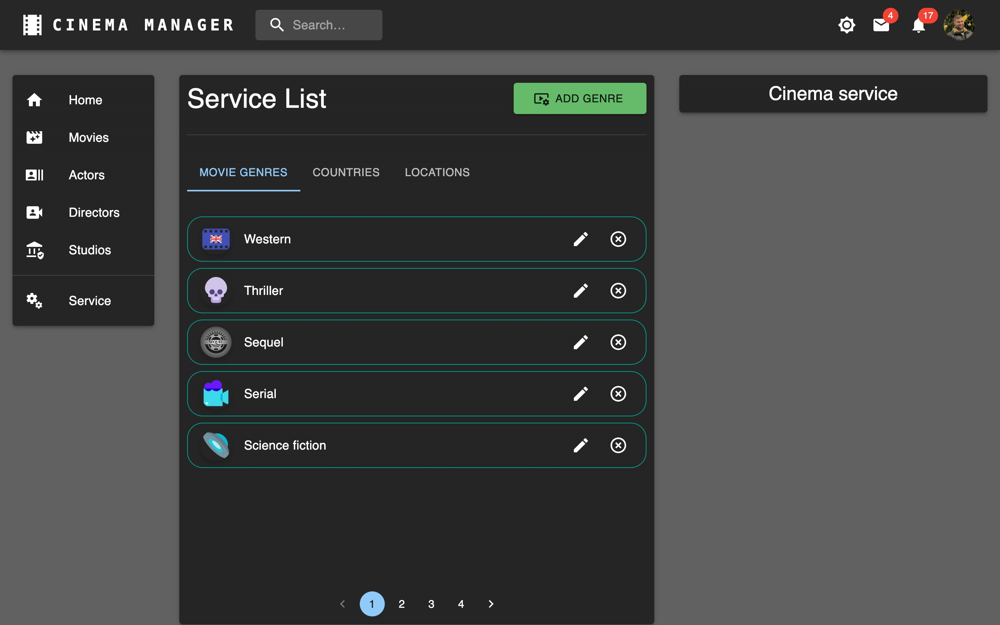
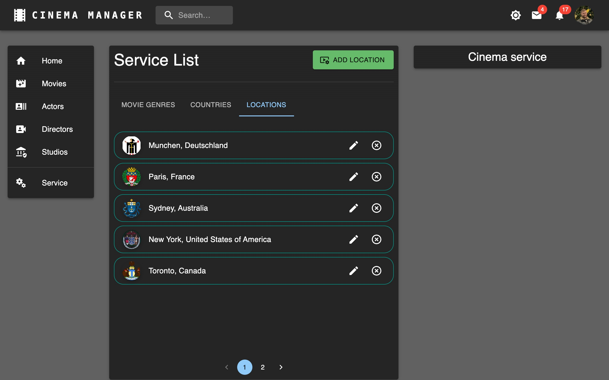
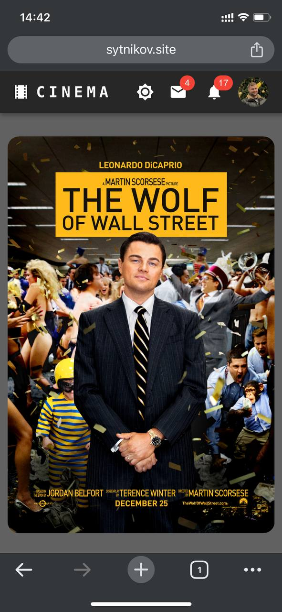

# CLIENT

<p align="center">
  
</p>

<p align="center">
  
</p>

## Project Description

Cinema manager client is a project that implements the ability to store and organize information about movies, actors, directors, and studios. It allows users to store and view information about actors and directors, as well as view movie storylines and trailers.

<h1 style="color: #007bff;">↓ Screenshots of the Project ↓</h1>

<details>
  <summary><strong>Here are some screenshots of the project, click to expand:</strong></summary>
  



























</details>

## Changelog by history commit

<details>
  <summary><strong>Warning! There is a lot of information here, click to expand:</strong></summary>

### August 2024

- **Aug 13**:

  - Fixed README
  - Added screenshots & updated README.md
  - Removed 'concurrently' from project
  - Updated information in package.json
  - Moved validation schemas to itemService.js
  - Added 'createdAt' & 'updatedAt' to main \*Item components

- **Aug 12**:

  - Added validation messages in \*Form components
  - Replaced 'unknown Country' with 'unknown nationality'
  - In StudiosItem, displayed Country next to Location if specified
  - Fixed 'formattedActors', 'formattedDirectors' & 'formattedStudios' function
  - Fixed MoviesForm (fixed get unique option in autocomplete)
  - Fixed FieldArrayAutocompleteField hook

- **Aug 11**:

  - Fixed error message handling
  - Updated eslint & eslint.config.js
  - Updated all dependencies in project to latest
  - Replaced usePaginatedData with useFetchData in \*Form components

- **Aug 10**:

  - Fixed formatted*Entity* in \*Item components
  - Created hook useFetchData
  - Fixed formatDate function

- **Aug 8**:

  - Optimizing ServicesList components
  - Fixed router paths for Service (Genre, Country & Location)
  - Created Services List & Forms
  - Сannot select a death date earlier than birth date

- **Aug 7**:

  - fieldArray no longer sends empty lines to the server
  - Renamed 'GroupedAutocompleteField' to 'FieldArrayAutocompleteField'
  - Created GroupedAutocompleteField component and used this in \*Form components
  - Created BasicAutocompleteField component and used this in \*Form components
  - Refactoring MoviesForm (remove duplicated code)
  - Reading Genres, Countries & Locations from database
  - Created Genre, Country & Location ...Service.js
  - Replacing absolute paths to entities with variables
  - NavBar is shown and hidden by clicking on the Header (Cinema) on mobile devices
  - Fixed errors in ThemeContext
  - Created ThemeContext
  - Fixed adaptivity for mobile devices (Layout)
  - Refactoring \*List & HomePage components: move Skeleton to skeletonService component

- **Aug 6**:

  - Added 'Skeleton' to \*Item components
  - Fixed errors (redirect after create/update) in \*Form components
  - Refactoring MoviesForm to works without redux state
  - Refactoring all components (Movies) as Actors components
  - Except MoviesForm component
  - Fixed display movie array in \*Item components
  - Renamed function 'onItemDelete' to 'on*Entity*Delete'
  - Refactoring all components (Studios) as Actors components
  - Refactoring all components (Directors) as Actors components
  - Send Actor biography information to 'ActorsBiography' via props
  - Renamed '\_SLICE_NAME' to '\_ENTITY_NAME'
  - Refactoring ActorsItem & ActorsBiography components to works without redux state
  - Refactoring HomePage with SnackbarContext
  - Created SnackbarContext & SnackbarComponent

- **Aug 5**:

  - Fixed errors in ActorsForm component
  - Refactoring ActorsForm to works without redux state
  - Refactoring ActorsList with actorService.js
  - Moved 'useEffect' from App to Entities root components
  - Show error.message in snackbar if error
  - Refactoring HomePage to works without redux state
  - Refactoring MoviesList to works without redux state
  - Refactoring StudiosList to works without redux state
  - Refactoring DirectorsList to works without redux state
  - Added ACTORS_SLICE_NAME to ActorsList component
  - Fixed pagination in ActorsList component

- **Aug 4**:

  - Refactoring ActorsList to works without redux state

- **Aug 3**:

  - Removed 'reverse data in state' for all entities

- **Aug 2**:

  - The client part is separated from the
    [json-server](https://github.com/sytnikovzp/Cinema-manager-json-server)

### July 2024

- **Jul 12**:

  - 'Cinema manager' in Header component links to '/'
  - Only Movies with posters are displayed on the main page
  - Removed routes for json-server

- **Jul 11**:

  - Added routes '/api' to json-server
  - Fixed BASE_URL: Added HTTPS

- **Jul 8**:

  - FieldArray (with autocomplete): Selected items cannot be selected again in another dropdown list
  - Replacing ternary operators with logical OR

- **Jul 7**:

  - Fixed 'filtered\*entity_name\*List' function in MoviesItem component

- **Jul 6**:

  - Hides the 'paper' component (in *list or *item components) when the form-service is displayed
  - Fixed 'height' property in scrollListBoxStyle
  - Added 'edit' route to root components of entities + CinemaService
  - Fixed services files

- **Jul 5**:

  - Added 'Skeleton' component to HomePage
  - Moved 'useEffect' (getAll\*entity_name\*) to root App component
  - Show last 15 Movies at HomePage carousel
  - Added content to the site again...

- **Jul 3**:

  - Set 8 items on screen a 'Xl' display resolution
  - In MoviesItem component the Actors & Directors & Studios are clickable
  - In StudiosItem component the Movies are clickable
  - Changed title on button from 'Go back' to 'To \*entity_name\*'
  - In DirectorsItem component the Movies are clickable
  - In ActorsItem component the Movies are clickable
  - Added threshold restrictions for dates in DatePicker (\*form components)
  - Reverse last 7 movie at HomePage
  - Added 'calculateAge' function to ActorsItem&DirectorsItem
  - Added content to site...

- **Jul 2**:

  - Moving the custom hook 'useItemsPerPage' into a separate file
  - Added pagination to StudiosList with hook 'useItemsPerPage'
  - Added pagination to MoviesList with hook 'useItemsPerPage'
  - Added pagination to DirectorsList with hook 'useItemsPerPage'
  - Added 'useItemsPerPage' hook to determine the number of items per page depending on screen resolution
  - Added pagination to DirectorsList
  - All \*list components show new elements first
  - Replaced 'select' Actors&Directors&Studios with 'Autocomplete with group' in MoviesForm
  - Replaced 'select' Genre with 'Autocomplete' in MoviesForm
  - Replaced 'select' Location with 'Autocomplete' in StudiosForm
  - Replaced 'select' nationality with 'Autocomplete' in DirectorsForm
  - Replaced 'select' nationality with 'Autocomplete' in ActorsForm

### June 2024

- **Jun 28**:

  - Poster at HomePage are clickable
  - Fixed 'carouselStyles' in styleService
  - Display last seven Movies poster at HomePage
  - Added sort 'options' function in 'select`s' to ActorsForm & DirectorsForm & StudiosForm
  - Added sort 'options' function in 'select`s' in MoviesForm
  - Replaced 'Great Britain' with 'Great Britain (England)' in db.json
  - Added info in db.json from Yan's 'Cinema' DB dump

- **Jun 24**:

  - Replaced 'foundationYear' with 'foundation_year' name field in Studios components
  - Replaced 'releaseYear' with 'release_year' name field in Movies components
  - Replaced 'birthDate' with 'birth_date' name field in Actors&Directors components
  - Replaced 'fullName' with 'full_name' name field in Actors&Directors components
  - Replaced 'image' with 'photo' name field in Actors&Directors components
  - Refactoring 'formatDate' function in Actors&Directors \*items components
  - Set stepper to 'horizontal' in MoviesForm component
  - Moved 'stack buttor' to 'StepContent' block
  - Set stepper to 'vertical' in MoviesForm component
  - Fixed 'reset' button in MoviesForm component
  - Added 'clearable' properties to DatePicker in MoviesForm & StudiosForm
  - Fixed export Layout component (fix apply theme in App.jsx)

- **Jun 23**:

  - Removed unused dependencies
  - Updated dependencies: Vite 5.3
  - Updated all dev dependencies
  - Updated all usually dependencies

- **Jun 22**:

  - Added 'formatDate' function in Actors&Directors \*item components
  - Added 'death date' to Actors&Directors
  - Created stackButtonFormStyle in styleService.js
  - Added button 'Add \*\*\*' to fieldArray in MoviesForm component
  - Replaced 'goBack' buttor with 'return' buttor in \*form components
  - Filling the db.json: filling with information about Studios, Directors, Actors and films
  - Removed fieldArray 'Movies' from Actors&Directors&Studios \*form components

- **Jun 21**:

  - Removed 'Movies' array from db.json in Actors&Directors&Studios entity
  - Added filteredMoviesList function to Actors&Directors&Studios items components
  - Fixed Divider in MoviesItem component
  - Renamed 'StudiosGenInfo' component to 'StudiosAbout'
  - Renamed tabs in \*item components
  - Set minRows & maxRows to storyLine input in MoviesForm component
  - It is forbidden to proceed to the next step in Stepper if the required fields are not filled in (MoviesForm)

- **Jun 19**:

  - Fixed data in db.json
  - Fixed 'paddingRight' in \*item components
  - Filling the db.json: filling with information about Studios, Directors, Actors and films
  - Fixed button in MoviesForm component
  - Added MUI Stepper component to MoviesForm component
  - Fixed 'useEffect' (snackbar) in \*item components
  - Replaced the 'textField' with 'select' in the 'fields array' in MoviesForm component

- **Jun 18**:

  - Added 'Skeleton' component to MoviesList component
  - Added 'Skeleton' component to StudiosList component
  - Added 'Skeleton' component to DirectorsList component
  - Added 'Skeleton' component to ActorsList component
  - Fixed error message in 'setError' reducer-service.js
  - Added a more informative error status to the slices in case of 'errors'
  - Refactoring StudiosForm as MovieForm component
  - Created 'saveButtonFormStyle' in styleService.js
  - Added Locations to constants.js
  - Refactoring DirectorsForm as MovieForm component
  - Refactoring ActorsForm as MovieForm component
  - Added nationalities to constants.js
  - Changed the display order of buttons in MoviesForm component
  - Added 'controls' param to playerVars in MoviesPlayer component
  - A 'Clear field' button has been added to textfield in MoviesForm component
  - 'Genre' field and 'year' field on one line in MoviesForm component

- **Jun 17**:

  - Set type select for 'Genre' in MoviesForm component
  - Added array of Genres to constants
  - Fixed 'Box' height in *list & *item components
  - Fixed styles in MoviesPlayer component
  - Replaced 'about of' with 'about the' in \*item components
  - Added general information about the Studios in db.json
  - Refactoring the StudiosItem component as an ActorItem
  - Fixed StudiosGenInfo component
  - Created StudiosGenInfo component
  - Added 'genInfo' field to StudiosForm component
  - Added Directors biography in db.json
  - Refactoring the DirectorsItem component as an ActorItem
  - Created DirectorsBiography component
  - Added 'biography' field to DirectorsForm component
  - Replacing the ternary operator with a logical 'or' in ActorsList component
  - Added Actors biography in db.json
  - Refactoring design of ActorsItem & ActorsBiography components
  - Refactoring design of MoviesItem component
  - Added storylines for Movies in db.json
  - Created 'textIndentStyle' in styleService.js & apply it to storyline in MoviesItem component
  - Added textfield 'storyline' to MoviesForm and display it in MoviesItem component
  - Fixed tab view in ActorsItem & ActorsBiography components
  - Defined textfield Biography as multiline component

- **Jun 16**:

  - Added field 'Biography' to ActorsForm component
  - Created ActorsBiography component
  - Added MUI Tabs to ActorItem component
  - Added 'origin' properties to playerVars in MoviesPlayer component
  - Separated 'scrollBoxStyle' to 'scrollListBoxStyle' & 'scrollMovieBoxStyle'
  - Added MUI Tabs to MoviesItem component
  - Setting up a react-player component
  - Changed scrollBoxStyle height to '70vh'
  - Set Typography variant='h5' to Title/FullName in \*item components

- **Jun 15**:

  - Created 'playerStyle' in styleService.js
  - Installed 'react-player' & create MoviesPlayer component
  - Added trailer URL to all Movies (db.json)
  - Added 'Trailer URL' to MoviesForm component
  - Added ternary operator to display fullname/title 'Unknown' in \*list components if empty value
  - Added ternary operator to display fullname/title 'Unknown' in \*item components if empty value
  - Removed ID button 'id=goBack-btn' from \*item components
  - Added 'Added Studio' button to StudiosItem component
  - Added 'Added Movie' button to MoviesItem component
  - Added 'Added Director' button to DirectorsItem component
  - Added 'Added Actor' button to ActorsItem component
  - Fixed 'Genre' field in MoviesForm
  - Moved 'useEffect' from other components to root component Studios
  - Moved 'useEffect' from other components to root component Movies
  - Moved 'useEffect' from other components to root component Directors
  - Moved 'useEffect' from other components to root component Actors

- **Jun 14**:

  - Uncomment 'open' parameter in vite.config.js

- **Jun 13**:

  - Reorganized styleService.js file
  - Created 'scrollBoxStyle' in styleService.js
  - Created 'itemComponentBoxThirdStyle' in styleService.js
  - Created 'itemComponentBoxSecondaryStyle' in styleService.js
  - Created 'itemComponentBoxMainStyle' in styleService.js
  - Replaced 'styte' to 'sx' in all form components
  - Created 'fieldArrayStyle' in styleService.js
  - Created 'formStyle' in styleService.js
  - Created 'rootComponentPaperStyle' in styleService.js
  - Changed icon in button 'Added movie/Studio' in MoviesList & StudiosList components
  - Changed image 'No poster avaible' in MoviesItem component
  - Added divider component to Actor/Director/Movie/Studio items components
  - Added divider component to Actor/Director/Movie/Studio lists components

- **Jun 12**:

  - Added 'Number' fix to all forms
  - Fixed data in db.json
  - Refactoring Movies, MoviesForm, MoviesItem & MoviesList components
  - Refactoring Studios, StudiosForm, StudiosItem & StudiosList components
  - Refactoring DirectorsForm components
  - Fixed 'goBack' function in ActorsForm
  - Added rounding of fieldset and legend presented as typography
  - Added fieldset & legend to ActorsForm
  - Refactoring Directors, DirectorsForm, DirectorsItem & DirectorsList components
  - Updated Directors, Movies & Studios slices
  - Added hook 'useSnackbar' to ActorsItem & add resetStatus function
  - Created hook 'useSnackbar' & use it in ActorsList component
  - Replacing MUIAlert with a Alert
  - Align a FieldArray items to its full width in ActorsForm
  - Added ternary operator to display information about an Actor
  - Fixed navigate button in ActorsForm, ActorsItem, ActorsList components
  - Added FieldArray to ActorsForm
  - Fixed DatePicker in ActorsForm
  - Fixed ActorsForm with formik
  - Fixed 'Edit' button to ActorsItem

- **Jun 9**:

  - Added 'Edit' button to ActorsItem
  - Added ListItemButton to ActorsList

- **Jun 8**:

  - Added stack to edit&delete icon
  - Refactor ActorsList with Link component
  - Moved Added button & state from root Actors to ActorsList

- **Jun 5**:

  - Added Number() to entities id
  - Fixed id in ActorsForm component
  - Fixed id entities in routers (Actors & Directors & Movies & Studios)
  - Updated Studios & StudiosItem & StudiosList components
  - Updated Movies & MoviesItem & MoviesList components
  - Updated Directors & DirectorsItem & DirectorsList components
  - Updated director & movie & studio slices
  - Fixed form in ActorsForm component
  - setStatus 'null' instead of 'pending'
  - Removed selectActor, addNewActor reducers from actorsSlice
  - Removed createEmptyActor from actorsSlice
  - Removed currentContact & getActorById from actorsSlice
  - Fixed button in ActorsForm
  - Fixed ListItem margin in ActorsList component
  - Fixed ActorsList component (onItemEdit function)
  - Fixed ActorsItem component
  - Fixed ActorsList component
  - Fixed delete function in ActorsList component
  - Fixed Actors component
  - Added concurrently to project (needed to run on my server!)
  - Test deploy to my server
  - Changed favicon image
  - Deploy 'pattern' from Actors component to Directors, Movies, Studios components
  - Added primitive form to ActorsForm component

- **Jun 4**:

  - Theme state is stored in the browser localStorage
  - Fixed errors (get**\*\***ById.fulfilled) in slices
  - Added settings for server

- **Jun 3**:

  - Added edit icon to Actors item
  - Removed from ActorsItem component unnecessary tags
  - Set ActorsList item color to text.primary
  - Added visual formatting for the ActorsItem component
  - Refactoring ActorsItem components
  - Refactoring ActorsList components
  - Fixed scroll in ActorsList component
  - Added Actor list & Actor list item to ActorsList & ActorsItem components
  - Changed background color for light & dark theme in Layout component
  - Fixed theme.palette.grey for dark theme in Footer component
  - Fixed routes in App component
  - Added listItemTextStyle to ListItem in NavBar
  - Added Paper & Box to CinemaService component
  - Added Box to NavBar component
  - Added menu to NavBar component
  - The Layout component takes up the full height of the visible area
  - Added footer to Footer component
  - Added dark mode switchable by button in Header

- **Jun 2**:

  - Removed dark theme
  - Set dark theme to App
  - Added App Bar to Header component
  - Added stopAutoPlayOnHover prop to Carousel
  - Renamed style 'Caroucel' by 'Carousel'
  - Refactorind initialStates by db.json structure
  - Added separator to import block
  - Fixed work poster carousel
  - Added open option to server object (vite.config.js)
  - Replacing poster URLs with new ones

- **Jun 1**:
  - Created slice for Movies
  - Created slice for Studios
  - Created slice for Directors
  - Created slices for Actors
  - Added store provider to Main component

### May 2024

- **May 26**:
  - Created empty store
  - Implement HomePage & Carousel
  - Implement CinemaService
  - Created main components
  - Installed main dependencies
  - Initial commit

</details>

## Key Highlights

- **Main Entities**:

  - **Actors**: Information about actors
  - **Directors**: Information about directors
  - **Movies**: Information about movies
  - **Studios**: Information about studios

- **Secondary Entities**:

  - **Genres**: Movie genres
  - **Countries**: Countries
  - **Locations**: Locations

## Features

- **CRUD Operations**: Full Create, Read, Update, and Delete functionality for main and second entities.
- **Form Handling**: Dynamic forms with validation using Yup and Formik.
- **Pagination**: Efficient data management with paginated lists.
- **Responsive Design**: Optimized for both desktop and mobile devices.
- **Dark Theme**: Stylish dark theme for a modern look and feel.
- **Carousel Component**: Showcase movie posters with a carousel component.
- **Error Handling**: User-friendly error messages and notifications.
- **Localization**: Support for multiple locations and nationalities.

## Technologies and Libraries

- **React**: Library for building user interfaces.
- **Material UI**: UI components and styling.
- **Formik**: Form management and validation.
- **Yup**: Schema validation for form fields.
- **Axios**: HTTP requests.
- **React Router**: Routing and navigation.
- **Vite**: Build tool for fast development.
- **React player**: For displaying movie trailers.
- **@reduxjs/toolkit 2**: For application state management (currently disabled).

## System Requirements

- **Git**: 2.46
- **NodeJS**: v18.20
- **NPM**: 10.8

## Installation

1. Clone the repository:
   ```bash
   git clone git@github.com:sytnikovzp/Cinema-manager-client.git
   ```
2. Navigate to the project directory:
   ```bash
   cd Cinema-manager-client
   ```
3. Install dependencies:

   ```bash
   npm i
   ```

## Start client

```bash
npm start
```

## Server-Side Links

- [CINEMA MANAGER server (with Express & Sequelize)](https://github.com/sytnikovzp/Cinema-manager-server)

- [CINEMA MANAGER server (with Express & Json-Server)](https://github.com/sytnikovzp/Cinema-manager-json-server)
