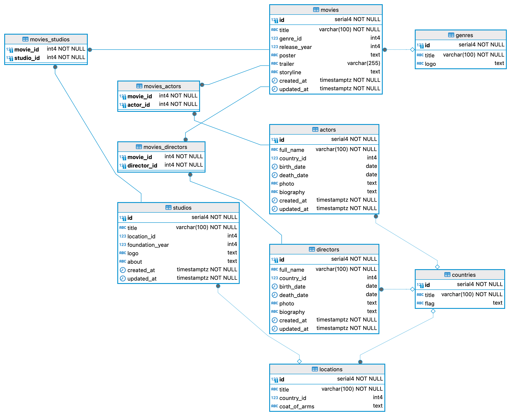

# SERVER

<p align="center">
  
</p>

<p align="center">
  
</p>

## Project Description

Cinema manager server is a project that implements the ability to store and organize information about movies, actors, directors, and studios. It allows users to store and view information about actors and directors, as well as view movie storylines and trailers.

## Changelog by history commit

<details>
  <summary><strong>Warning! There is a lot of information here, click to expand:</strong></summary>

### August 2024

- **Aug 13**:

  - Fixed README
  - Added 'ERD' and created README.md
  - Updated information in package.json
  - Fixed 'regExp' in 'TITLE_NAME' validation schema
  - Changed 'createdAt & updatedAt' format
  - Added validation messages

- **Aug 12**:

  - Fixed error in studioController
  - If the client passes an empty string, then "null" is written to DB (Patch func)
  - If the client passes an empty string, then "null" is written to DB (Update func)
  - If the client passes an empty string, then "null" is written to DB (Created func)
  - Fixed error in studioController
  - If the DB contains 'null', an empty string is returned to the client

- **Aug 11**:

  - Added pagination to genre, country & location controllers
  - Refactoring validate.mw

- **Aug 9**:

  - 'createdAt' & 'updatedAt' now in human readable format (by moment)
  - Refactoring movieController
  - Refactoring studioController
  - Refactoring directorController
  - Refactoring actorController
  - Refactoring genre, country & location controllers
  - Added 'time & date' middleware

- **Aug 7**:

  - Set default limit 500 to pagination MW
  - Added order by 'DESC' to Genre, Country & Location controllers
  - Removed field 'code' from 'Countries'

- **Aug 5**:

  - Added X-Total-Count headers to actorController & directorController

- **Aug 4**:

  - Set big default value to pagination MW
  - Fixed errors in movies_directors & movies_studios models

- **Aug 3**:

  - Added aliases to actorController
  - Removed movieActorController
  - Added logging to createMovie function
  - Edit function createMovie in movieController
  - Fixed errors in tests files
  - Fixed pagination path in tests files
  - Fixed get\*Entity\* function in controllers
  - Fixed get\*Entity\*ById function in controllers
  - Created movieActorController & fix pagination

- **Aug 2**:

  - Created movieActorController

- **Aug 1**:

  - Created studioController
  - Created movieController
  - Added patch method to actorController & directorController
  - Created directorController
  - Created actorController
  - Created locationController
  - Created countryController
  - Created genreController & validationSchemas

### July 2024

- **Jul 31**:

  - Created all seeders for all entities

- **Jul 30**:

  - Created seeders for all entities
  - Created relations between tables (entities)
  - Created tables for all entities
  - Added http-errors & Sequelize to project

- **Jul 1**:
  - Added validation to PUT method in all controller
  - Created studioRouters & refactor studioController
  - Added check for directors.rows.length in directorController.js
  - Added check for actors.rows.length in actorController.js
  - Fixed validationSchemas
  - Created movieRouters & refactor movieController
  - Added CORS library

### June 2024

- **Jun 30**:

  - Consolidated all middleware in index.js
  - Created errorHandlers
  - Created validation with Yup
  - Installed Yup
  - Created routers for actorRouters & directorRouters
  - Refactoring directorController with DB cinema
  - Refactoring actorController with DB cinema

- **Jun 29**:

  - Added and setting DB connection

- **Jun 26**:

  - Removed unnecessary items from the project
  - Implemented movieController.js & movies.http
  - Implemented studioController.js & studios.http
  - Implemented directorController.js & directors.http
  - Implemented actorController.js & actors.http

- **Jun 23**:

  - Added middleware
  - Separate index and app
  - Create server with express
  - Added 'express'

- **Jun 22**:

  - Added code for modules path&os&process
  - Initial commit

  </details>

## Entity Relationship Diagram

<p align="center">
  
</p>

## Key Highlights

- **Main Entities**:

  - **Actors**: Information about actors
  - **Directors**: Information about directors
  - **Movies**: Information about movies
  - **Studios**: Information about studios

- **Secondary Entities**:
  - **Genres**: Movie genres
  - **Countries**: Countries
  - **Locations**: Locations

## Features

- **CRUD Operations**: Full Create, Read, Update, and Delete functionality for movies, actors, directors, studios, genres, countries, and locations.
- **Pagination**: Implemented pagination with customizable limits and sorting for efficient data retrieval in controllers for genres, countries, locations, and actors.
- **Validation**: Comprehensive validation using Yup for input data to ensure data integrity and proper error handling.
- **Error Handling**: Centralized error handling with clear and informative error messages using the 'http-errors' library.
- **Logging**: Added logging functionality for debugging and tracking operations in the create movie function and other critical areas.
- **Database Operations**: Advanced database interactions with Sequelize, including handling 'null' values, relationships, and seeding data.
- **Date and Time Formatting**: Utilizes Moment.js to format date and time fields for human-readable output.
- **Middleware**: Custom middleware for handling validation, error processing, and setting default limits for pagination.
- **Data Consistency**: Ensures consistency in data formats and handles different data types, such as strings and objects, across various controllers.

## Database Interaction

Sequelize is used for database interaction, with models, migrations, and seeders defined for initial data population. Controllers are written to handle client interactions with the database through this server.

## Technologies and Libraries

The server-side project is built using the Express framework. The following libraries are used:

- **cors**: To handle cross-domain requests.
- **http-errors**: To handle and display errors.
- **sequelize & sequelize-cli**: For interacting with the database, along with the **pg** and **pg-hstore** drivers.
- **yup**: For validation.
- **moment**: For date handling.
- **dotenv**: For environment variable management.

Middleware includes:

- **errorHandlers**: For error handling and display.
- **validate**: For validating incoming data with pre-written validation schemas.
- **paginate**: For pagination.
- **time**: For formatted console output.

## System Requirements

- **Git**: 2.46
- **NodeJS**: v18.20
- **NPM**: 10.8
- **PostgreSQL**: 16.3

## Installation

1. Clone the repository:
   ```bash
   git clone git@github.com:sytnikovzp/Cinema-manager-server.git
   ```
2. Navigate to the project directory:
   ```bash
   cd Cinema-manager-server
   ```
3. Install dependencies:
   ```bash
   npm i
   ```

## Config .env variables

Create your configuration file `.env`

```yaml
PORT=5000
DB_PORT=5432
DB_USER=postgres
DB_PASS=root
DB_NAME=cinema_manager
DB_HOST=localhost
```

## Database Initialization

1. Creating new Database:

   ```bash
   npm run dbcreate
   ```

2. Run Migrations & Seeding the Database:

   ```bash
   npm run initial
   ```

## Start server

```bash
npm start
```

## Client-Side Links

- [CINEMA MANAGER client (with Vite)](https://github.com/sytnikovzp/Cinema-manager-client)
